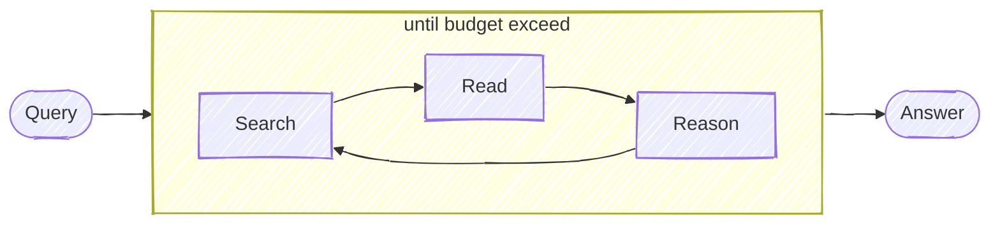

# DeepResearch

Keep searching, reading webpages, reasoning until it finds the answer (or exceeding the token budget).



## Install

We use OpenAI GPT-4o or DeepSeek-V3 for LLM and support both [Jina Reader](https://jina.ai/reader) and Brave Search for searching and reading webpages.

### Environment Variables
Required:
```bash
# OpenAI Configuration
export OPENAI_API_KEY=...  # OpenAI API key
export OPENAI_BASE_URL=...  # OpenAI API base URL (optional)
export OPENAI_MODEL=deepseek-ai/DeepSeek-V3  # Or any other supported model

# Search Provider Configuration
export JINA_API_KEY=jina_...  # Get from https://jina.ai/reader
export SEARCH_PROVIDER=jina  # Options: 'jina' or 'brave'
export BRAVE_API_KEY=...     # Required if using SEARCH_PROVIDER=brave

# Optional Configuration
export STEP_SLEEP=1000  # Event stream delay in milliseconds (default: 100)

### Installation

1. Clone the repository:
```bash
git clone https://github.com/momomoai/DeepResearch.git
cd DeepResearch
```

2. Install dependencies with Poetry:
```bash
# Install Poetry if not already installed
curl -sSL https://install.python-poetry.org | python3 -
poetry install
```

3. Configure environment:
- Copy .env.example to .env.local
- Fill in required environment variables
```

## Usage

```bash
env $(grep -v '^#' .env.local | xargs) poetry run uvicorn deepresearch.main:app --host 0.0.0.0 --port 3001
```

## Demo
Query: `"what is the latest blog post's title from jina ai?"`
3 steps; answer is correct!


Query: `"what is the context length of readerlm-v2?"`
2 steps; answer is correct!


Query: `"list all employees from jina ai that u can find, as many as possible"` 
11 steps; partially correct! but im not in the list :(


Query: `"who will be the biggest competitor of Jina AI"` 
42 steps; future prediction kind, so it's arguably correct! atm Im not seeing `weaviate` as a competitor, but im open for the future "i told you so" moment.


More examples:

```bash
# example: no tool calling 
poetry run python -m deepresearch.main "1+1="
poetry run python -m deepresearch.main "what is the capital of France?"

# example: 2-step
poetry run python -m deepresearch.main "what is the latest news from Jina AI?"

# example: 3-step
poetry run python -m deepresearch.main "what is the twitter account of jina ai's founder"

# example: 13-step, ambiguous question (no def of "big")
poetry run python -m deepresearch.main "who is bigger? cohere, jina ai, voyage?"

# example: open question, research-like, long chain of thoughts
poetry run python -m deepresearch.main "who will be president of US in 2028?"
poetry run python -m deepresearch.main "what should be jina ai strategy for 2025?"
```

## Web Server API

Start the FastAPI server:
```bash
poetry run uvicorn deepresearch.main:app --host 0.0.0.0 --port 3000
```

The server will start on http://localhost:3000 with the following endpoints:

### POST /api/v1/query
Submit a query to be answered:
```bash
curl -X POST http://localhost:3000/api/v1/query \
  -H "Content-Type: application/json" \
  -d '{
    "q": "what is the capital of France?",
    "budget": 1000000,
    "maxBadAttempt": 3
  }'
```

Response:
```json
{
  "requestId": "1234567890"
}
```

### GET /api/v1/stream/:requestId
Connect to the Server-Sent Events stream to receive progress updates and the final answer:
```bash
curl -N http://localhost:3000/api/v1/stream/1234567890
```

The server will emit the following event types:
- Progress updates: Step number and budget usage
- Final answer with complete response data
- Error messages if something goes wrong

Example events:
```
data: {"type":"progress","trackers":{"tokenUsage":74950,"tokenBreakdown":{"agent":64631,"read":10319},"actionState":{"action":"search","think":"The provided text mentions several investors in Jina AI but doesn't specify ownership percentages.  A direct search for ownership percentages is needed to answer the question definitively.","URLTargets":[],"answer":"","questionsToAnswer":[],"references":[],"searchQuery":"Jina AI investor ownership percentages"},"step":7,"badAttempts":0,"gaps":[]}}

data: {"type":"progress","trackers":{"tokenUsage":74950,"tokenBreakdown":{"agent":64631,"read":10319},"actionState":{"action":"search","think":"The provided text mentions several investors in Jina AI's funding rounds but doesn't specify ownership percentages.  A search focusing on equity stakes and ownership percentages held by each investor will provide the necessary information to answer the main question.","URLTargets":[],"answer":"","questionsToAnswer":[],"references":[],"searchQuery":"Jina AI investor equity percentage ownership stake"},"step":8,"badAttempts":0,"gaps":[]}}

data: {"type":"progress","trackers":{"tokenUsage":88096,"tokenBreakdown":{"agent":77777,"read":10319},"actionState":{"action":"search","think":"The provided text mentions several investors in Jina AI's funding rounds but doesn't specify ownership percentages.  A search focusing on equity stakes and ownership percentages held by each investor will provide the necessary information to answer the main question.","URLTargets":[],"answer":"","questionsToAnswer":[],"references":[],"searchQuery":"Jina AI investor equity percentage ownership stake"},"step":8,"badAttempts":0,"gaps":[]}}
```

## Troubleshooting

### Common Issues

1. Authentication Errors
- Verify API keys are correctly set in environment variables
- Check OPENAI_BASE_URL if using a custom endpoint
- Ensure JINA_API_KEY or BRAVE_API_KEY matches SEARCH_PROVIDER setting

2. Search Provider Issues
- SEARCH_PROVIDER must be either 'jina' or 'brave'
- Corresponding API key must be set for chosen provider

3. Event Stream Delays
- Adjust STEP_SLEEP value (in milliseconds) if events are too slow/fast
- Default is 100ms, increase for slower updates or decrease for faster updates

4. Docker Issues
- Ensure all environment variables are properly set in docker-compose.yml
- Check container logs for specific error messages

## Docker

### Build Docker Image
To build the Docker image for the application, run the following command:
```bash
docker build -t deepresearch:latest -f deepresearch-py/Dockerfile .
```

### Run Docker Container
To run the Docker container, use the following command:
```bash
docker run -p 3000:3000 \
  --env OPENAI_API_KEY=your_openai_api_key \
  --env OPENAI_BASE_URL=your_openai_base_url \
  --env OPENAI_MODEL=deepseek-ai/DeepSeek-V3 \
  --env JINA_API_KEY=your_jina_api_key \
  --env SEARCH_PROVIDER=jina \
  --env STEP_SLEEP=1000 \
  deepresearch:latest
```

### Docker Compose
You can also use Docker Compose to manage multi-container applications. To start the application with Docker Compose, run:
```bash
docker-compose up
```

## How Does it Work?

Not sure a flowchart helps, but here it is:


